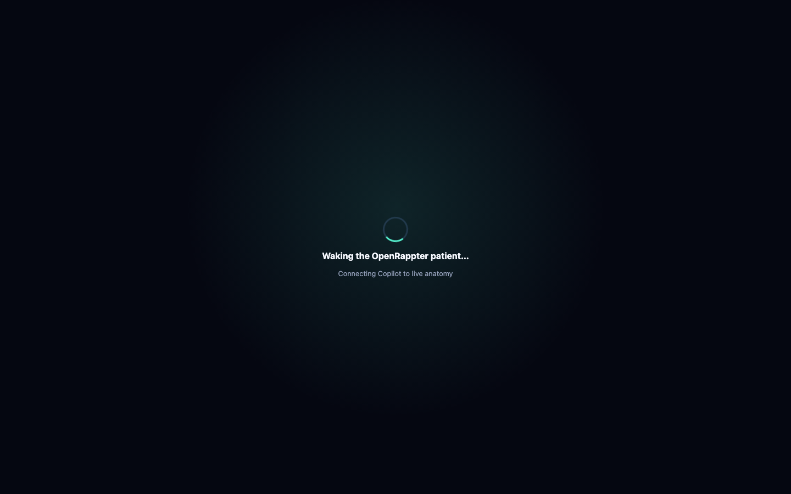

# Frontier Primary Interface Plan

## Visual authority

The authoritative interface is the existing Frontier composition in
`beta/ui`, backed by the real Brainstem chat in `rapp_brainstem/index.html`:

- main OpenRappter chat on the left;
- connection, model, settings, voice, registry, and agents controls above chat;
- prompt chips, transcript import/export, tutorial, help, and `.py` drop;
- GitHub Copilot multi-chat agent panel on the right, including prompt,
  Show mode, herd, and deploy flows.

No anatomy sidebar, operating-room shell, XP desktop, taskbar, Start menu,
window manager, or iframe around the previous dashboard is introduced.

## Default and migration

1. `typescript/scripts/build-ui.mjs` copies canonical `beta/ui` to
   `ui/dist`, which is both the hosted `/` and Electron renderer.
2. The prior Lit patient/Copilot interface is built once into
   `ui/dist/legacy` and labelled **Legacy Patient Interface**.
3. Legacy is explicit, reversible, and retained for one migration release.
4. Existing gateway, chat, memory, agent, skill, and configuration state is
   never rewritten during the UI migration.

## Native feature integration

Added capabilities live in one Frontier-styled modal opened beside the current
chat—not in another shell. It contains truthful adapters for:

- Clever Girl v3;
- release-ring state, preview, explicit apply, and receipts;
- Grail / Quantum RAPPIDs;
- seven Living Company data seams and deterministic Company Week;
- whole-organism egg import/export;
- adaptive twin versions and rollback;
- large-media ingest;
- Copilot auth/model and gateway `/health`;
- continuous voice and ElevenLabs;
- the OpenRappter Personal / private RapterOS boundary.

Missing dependencies report **unavailable** and never substitute a related but
different format or fabricate success.

## Control and safety contract

`openrappterFrontierSemantic` exposes only `open(feature)` and `snapshot()`.
The desktop command compatibility plane can navigate, inspect state, and run
the local fixture Company Week. Neither interface can approve, send, publish,
submit, execute shell commands, import an egg, or bypass native authorization.

Living Company Week is deterministic and records zero external sends,
publishes, submissions, or other side effects. CEO memo, expense, and meme
artifacts remain private drafts.

## Release evidence

The initial Frontier-primary contract had six failures and one pass: the
existing chat/Copilot composition was present, but the branch still booted the
added anatomy shell and lacked the corrected Frontier module/package names.
After correction, all seven contracts pass.

The first real packaged Electron run then reproduced the exact launch path with
`ERR_BLOCKED_BY_CSP`, `frontierChat:false`, and `frontierPrimary:false`: the
restored shell's `frame-src` allowed loopback but not its packaged same-origin
chat. The contract now pins `frame-src 'self'`; the repeated packaged run
reported both `frontierChat:true` and `frontierPrimary:true`.

Release gates cover the source DOM, hosted root package, deep links, explicit
Legacy route, browser behavior, semantic controls, accessibility/responsive
rules, Electron contracts, and real packaged smoke on Linux, macOS, and Windows.
