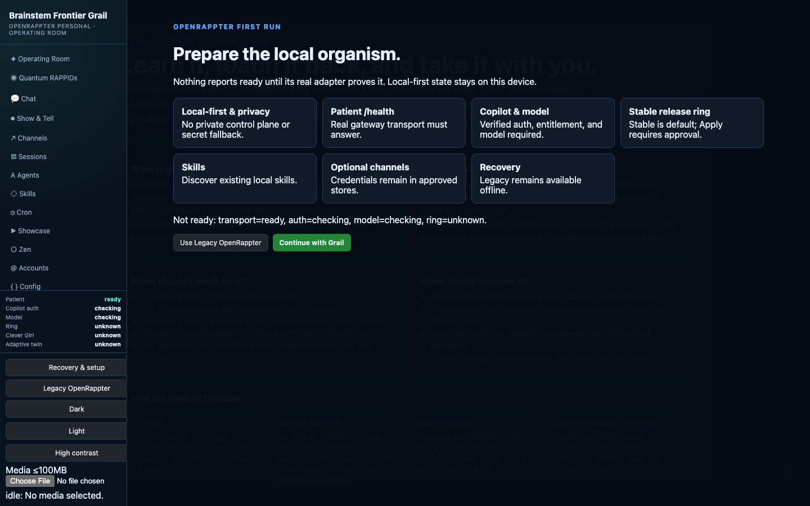

# Brainstem Frontier Grail Default Plan

## Authority and current mismatch

- **Authoritative Grail renderer:** `beta/ui/index.html`, `beta/ui/renderer.js`,
  and the supporting `beta/ui/*.js`/CSS modules.
- **Authoritative Grail desktop services:** `beta/electron/`.
- **Current production hosted/desktop UI:** Lit source in `typescript/ui/src`,
  built to `typescript/ui/dist`, then loaded by `typescript/desktop`.
- **Mismatch evidence:** `docs/assets/grail-before-default.png` shows the
  current production shell waiting on the patient instead of booting Grail.
  `grail-default-contract.test.ts` initially failed all seven contracts.

## One maintained path

1. Keep `beta/ui` as the single Grail renderer source.
2. Build/copy that source into the npm package's `ui/dist` root.
3. Build the existing Lit dashboard into `ui/dist/legacy` for one migration
   release; it remains reachable as **Legacy OpenRappter**.
4. Keep both Electron hosts loading their first-party Grail source rather than
   copying HTML or embedding the Lit dashboard in an iframe.
5. Use a small typed host adapter for hosted gateway RPC; native Electron keeps
   the existing `brainstemBeta` preload.

## Native Grail modules

Add an anatomy/operating-room sidebar and native Grail surfaces for:

- Copilot Surgeon and patient transport
- Quantum RAPPIDs habitat
- Chat, Show & Tell, Channels, Sessions, Agents, Skills, Cron, Showcase, Zen
- Accounts, Config, Devices, Health, Logs
- Living Company

No XPedition desktop, taskbar, Start menu, window chrome, or executable
extension host moves forward.

## Extract from #442

- Living Company registry/services, deterministic Company Week, private drafts,
  evidence ledger, and zero-side-effect receipts
- immutable payload/base-hash approvals
- bounded semantic snapshot/open controls (never approve/send/publish/submit/
  shell/import)
- local-first onboarding concepts, fail-closed Copilot readiness, Legacy
  recovery, focus containment, reduced motion, contrast, and responsive rules
- tenant-free OpenRappter Personal / private RapterOS boundary copy

These are reimplemented as Grail modules and adapters, not copied shell files.

## Dependency seams

Fail closed behind typed adapters:

- Clever Girl v3 and packaged CLI
- release ring and promotion receipts
- Copilot auth/model state and `/health` patient transport
- whole-organism egg import/export
- adaptive twin version/rollback
- large media ingest
- #445 data-only selector

When the independent PRs merge, retarget and replace adapters with their exact
interfaces. Do not copy unmerged implementations.

## Release gates

- failing-before default, patient/model/transport/contrast/100MB contracts
- unit, integration, semantic, a11y, responsive, package, and Electron tests
- deterministic Company Week through Grail with zero external effects
- real packaged Grail smoke on macOS/Linux/Windows
- screenshot/GIF evidence
- full UI, TypeScript, beta, lint, package, and CI green
