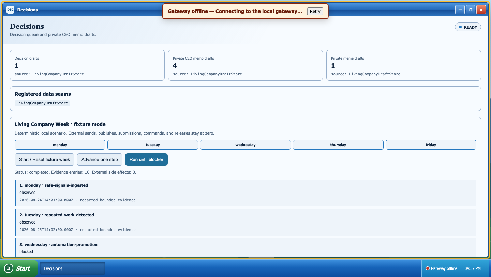

# The Living Company Desktop

The Living Company Desktop expands Windows XPedition from an agent desktop
into the operating surface for a small, local-first company. It is required
product UI, not a Showcase demo.

In OpenRappter Personal these applications operate on the owner's local
organism and fixture-safe seams. They are not multi-tenant SaaS surfaces.
Licensed, isolated hosted business organisms belong to the separate private
RapterOS product and integrate only through
[versioned XPedition extensions](./xpedition-extensions.md).

Every company application is registered in
`typescript/ui/src/services/company-app-registry.ts`. The shell has one generic
`<openrappter-company-app>` renderer; adding an application does not add another
shell conditional.

## Registered applications and truthful data

| Application | Real data seams | Deliberate limit |
|---|---|---|
| Engineering | `status`, `exec.pending`, `exec.history` | Repo, PR, and CI details wait for a bounded authenticated adapter. |
| Release Operations | `methods`, `exec.history`, `ReleaseRingAdapter` | Manifest resolution and promotion depend on the release-ring PR. |
| Customer Signals | `channels.list`, `chat.list` | No feedback is invented; message bodies are not read. |
| Documentation | `status`, `methods`, local clipboard | Copy code/prompt is local. There is no automatic publish. |
| Expenses | versioned private draft storage | Drafts are review-ready only; the user always submits. |
| Decisions | versioned private draft storage | CEO memos and memes remain private drafts. |
| RAPP Estate Health | `status`, `skills.list`, ecosystem-audit seam | Live drift and declared-core evidence require authenticated audit dependencies. |

An offline gateway produces an `offline` snapshot with the real error. A
missing RPC produces a named `partial` or `unavailable` state. Neither becomes
a zero metric or success-shaped placeholder.

## Approval boundary

These actions always require an action-bound request and a second explicit
human confirmation:

```text
external.send
external.publish
expense.submit
release.apply
release.promote
automation.promote
credential.change
shell.command
irreversible.action
```

The request binds the action and concise summary into a fingerprint. It can be
consumed once and only for that action. Approval buttons are marked
`data-desktop-sensitive="company-approval"`, so ordinary semantic click
automation cannot activate them.

`company_approve` exists only on the trusted renderer command plane for
deterministic harnessing. It requires `humanConfirmed: true`, is withheld from
agent-emitted `ui_commands`, and is explicitly rejected by
`DesktopControlAgent`. This mirrors the existing split between typed desktop
controls and higher-authority consent operations.

Release-ring Apply in both Settings and onboarding uses the same two-step
pattern. The first click creates a request; the second action-bound human click
may invoke the adapter. Selecting a ring never changes the runtime.
Authenticated configuration saves are gated as `credential.change`; cron-job
removal and session deletion are gated as `irreversible.action`. Keyboard
shortcuts and ordinary semantic clicks can request these actions but cannot
confirm them.

## Draft-only automation hooks

`LivingCompanyDraftStore` uses
`openrappter.living-company.private-drafts.v1` and stores only:

- concise private CEO memo drafts;
- one original private meme draft with alt text when evidence warrants it;
- review-ready, never-submitted expense drafts;
- decision drafts;
- documentation drafts with copy-ready code and prompts;
- fixture receipts that explicitly record `externalSideEffect: false`;
- a bounded redacted evidence ledger.

Private draft subtrees are excluded from model-visible desktop snapshots.
There is no send, publish, submission, credential, shell, or promotion RPC in
the store or company component.

## Living Company Week

The deterministic fixture scenario is controlled through:

```text
company_state
company_scenario operation=start|step|run|reset|replay
```

The human-only harness confirmation is:

```text
company_approve requestId=<pending id>
                companyAction=<exact action>
                approved=true|false
                humanConfirmed=true
```

### Walkthrough

1. **Monday:** ingest four safe local fixture signals. Only fixture IDs,
   sources, and counts enter the redacted ledger.
2. **Tuesday:** the injected v3 detector seam finds three repeated
   release-evidence refreshes and creates a decision plus private CEO memo.
3. **Wednesday:** stop at an `automation.promote` approval. After confirmation,
   create one local fixture promotion receipt.
4. **Thursday:** record a simulated gateway outage as `offline`, then a
   truthful explicit retry as `recovered`.
5. **Friday:** preview beta, stop at a `release.apply` approval, then apply only
   the injected fixture ring adapter. Create a docs draft, review-ready expense
   draft, private CEO memo, and one original private meme with alt text.

The final counters are invariant:

```json
{
  "externalSideEffects": 0,
  "sends": 0,
  "publishes": 0,
  "submissions": 0
}
```

Reset removes only artifacts carrying the fixture scenario ID. Replay produces
the same state, approval IDs, timestamps, and redacted ledger.



## Dependency seams and dogfood

- **Clever Girl detector v3:** production uses
  `RepeatedWorkDetectorAdapter`. The default scenario injects
  `FixtureRepeatedWorkDetectorAdapter`; `PendingV3DetectorAdapter` names the
  missing dependency and does not recreate detector logic.
- **Release rings:** production consumes `ReleaseRingAdapter`. The scenario
  injects `ScenarioReleaseRingAdapter`; it changes only fixture memory and
  explicitly reports that no manifest, package, tag, or external release
  changed.
- **Estate audit:** live ecosystem queries wait for the authenticated
  ecosystem-audit adapter. The UI only reports whether the skill is discovered.

Dogfood mode is constructor-gated by `allowDogfood: true` and injected
dependencies. It is not exposed by the semantic control API. Until both
dependencies land, the default remains fixture-only with zero external side
effects.
