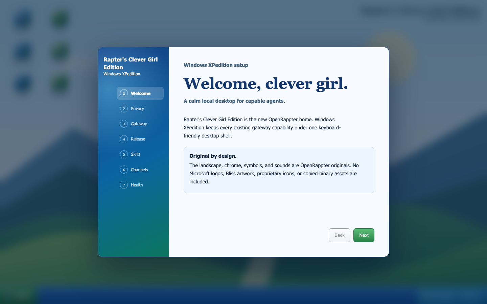

# Rapter's Clever Girl Edition: Windows XPedition

Windows XPedition is the default OpenRappter interface on the hosted dashboard
and in Electron. Its user slug is `rapters-clevergirledition`; the edition name
is `windows-xpedition`.

Its required operating layer is
[The Living Company Desktop](./living-company-desktop.md): seven registered
company applications, draft-only automation hooks, action-bound approval
gates, and a deterministic zero-side-effect work-week harness.

The default shell is branded **OpenRappter Personal / Rapter's Clever Girl
Edition**. It is tenant-free and contains no proprietary SaaS billing or
control-plane implementation. The sole v1 extension format is #445's
authoritative data-only `xpedition-extension-v1` selector: `appId`,
public read/view capability IDs, bounded order, and surface version may select
an existing first-party entry only. Display metadata and routes remain owned by
the trusted local registry.
Registration fails closed until #445 lands and its exact reader is installed.
V1 does not load supplied JavaScript, custom elements, URLs, IPC, credentials,
storage, DOM references, or direct control activation.

It is a desktop shell, not a static demonstration. Every operational window
mounts an existing Lit product surface and uses the existing authenticated
gateway client. The shell does not replace gateway RPC, approval, channel,
configuration, memory, or agent logic.



## Desktop

- **Clever Girl Observe** mounts the live Copilot Surgeon patient surface.
- **Chat & Agents**, **Agent Explorer**, **Showcase**, **Skills**, **Channels**,
  **Settings**, and **Flight Recorder** mount their existing UI components.
- **Memory** explains when the current gateway has no bounded Memory UI RPC;
  it never substitutes mock data. Existing local memory remains available to
  the Memory agent and CLI.
- **Terminal / Shell** appears only as an honest unavailable panel when the
  gateway has no standalone terminal route. Authorized Shell-agent operations
  are unchanged.
- **Help & About** documents keyboard controls and the migration escape hatch.

The original `xpedition-landscape.svg` is built with the UI. OpenRappter does
not ship Microsoft logos, Bliss wallpaper, Windows sounds, proprietary icons,
or copied binary assets.

### Keyboard and accessibility

- `Ctrl` + `Space`: open or close Start
- `Alt` + `Tab` or `F6`: cycle visible windows
- arrow keys: move among desktop shortcuts
- `Enter` or `Space`: open a focused shortcut
- `Escape`: close Start

Windows use labelled non-modal dialog semantics. Focus is visible, errors use
live regions and words as well as color, text scales with the browser, and the
shell supports light, dark, high-contrast, forced-colors, narrow-screen, and
reduced-motion modes.

## First-run onboarding

The seven setup pages are:

1. welcome to the edition;
2. local-first/privacy boundary;
3. real gateway connection and retry;
4. typed release ring, with `stable` as default;
5. real `skills.list` discovery;
6. optional channel setup guidance through the existing Channels surface;
7. a real gateway `health` RPC.

Setup completes only after a valid health response that is not `error`.
Disconnected, malformed, and failed responses remain visible and retryable.
The wizard stores only explicit non-secret UI preferences: completion, shell,
release ring, and contrast. Channel credentials and gateway secrets stay in
their existing protected stores.

Every step and error state includes **Use Legacy OpenRappter**. It works while
the gateway is offline, preserves existing state, and makes the migration
escape hatch available before onboarding completes. The wizard is a real modal:
focus enters it, background windows/taskbar/shortcuts are inert, Tab and
Shift-Tab stay contained, Escape keeps setup open and focuses the safe legacy
action, and focus is restored when the wizard leaves.

## Release-ring integration seam

The headless `ReleaseRingAdapter` accepts exactly:

```text
stable | beta | canary | alpha | nightly
```

The included fixture reports `stable` and refuses to pretend it resolved or
installed another ring. Selecting a preview ring displays a warning and
requires **Apply / Update**. Until the release updater supplies a concrete
adapter, that action reports `unavailable` and confirms that no manifest or
files changed. Manifest selection is deliberately not reimplemented in the UI.

## Migration and legacy shell

No existing OpenRappter state is deleted or rewritten. A missing preference
defaults to XPedition. During this migration release, choose
**Start → Legacy OpenRappter** to restore the previous sidebar/dashboard shell.
The legacy header has a **Windows XPedition** button to switch back.

Preferences use the versioned key
`openrappter.xpedition.preferences.v1`; the small
`openrappter.shell` compatibility key keeps shell selection reversible.

## Open core and hosted business boundary

OpenRappter Personal remains the free/open default organism. Rights to the open
core follow this repository's actual **Apache License 2.0** in `LICENSE` and
the notices in `NOTICE`; OpenRappter is not claimed to be MIT.

Hosted, licensed business-organism tenancy and training belong to the separate
private RapterOS SaaS. Tenant provisioning, billing, entitlement, training,
and private control-plane code are not part of XPedition or this repository.

An executable extension format is not shipped. Any future executable design
would require a distinct schema version and a separately reviewed sandbox; it
must not be interpreted as v1.

## Semantic desktop control

The existing `DesktopControl` queue and approval boundary now support these
bounded actions:

```text
desktop_state
open_app          appId from the exported, closed XPEDITION_APP_IDS catalog
focus_window      windowId from desktop_state
close_window      windowId from desktop_state
onboarding_step   step: welcome|privacy|gateway|release|skills|channels|health
switch_shell      shell: xpedition|legacy
company_state
company_scenario  operation: start|step|run|reset|replay
```

These actions only operate visible shell state. They cannot read secrets,
approve tools, install agents, bypass gateway authentication, or bypass native
consent. `company_approve` is withheld from agents and requires an exact
action-bound human confirmation on the trusted renderer plane. Existing
element-ref commands and their private/sensitive subtree guards are unchanged.
